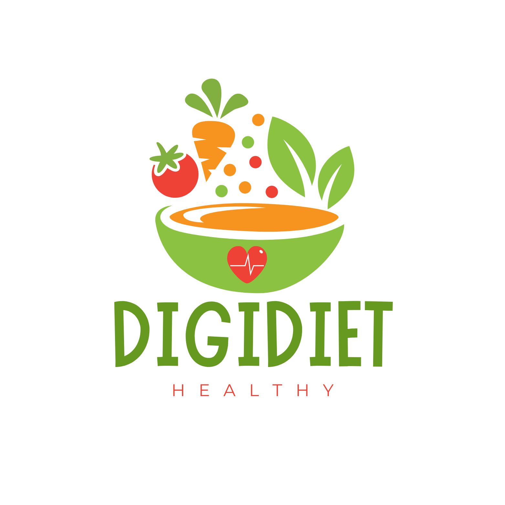

<h1 align="center">DigiDiet</h1>

  <h4>personalized diet plans with DigiDiet: A content-based recommendation web application powered by Scikit-Learn, FastAPI, and Streamlit..</h4>

### What is Food Recommendation System 🍎 ? 
A food recommendation engine is a system designed to suggest food items, recipes, or meal plans to users based on various inputs and criteria. These systems can utilize different recommendation techniques to provide personalized suggestions that cater to individual preferences, dietary needs, and health goal.

### What is a content-based recommendation engine 🔎?
A content-based recommendation engine is a system designed to suggest items to users based on the attributes and characteristics of those items, as well as the user’s previous interactions and preferences. This type of recommendation engine is commonly used in various applications, such as e-commerce, streaming services, and personalized diet plans

### Dataset🗄️
I utilized the Food.com Kaggle dataset, which includes over 500,000 recipes and 1,400,000 reviews from Food.com. For more information, you can visit this [Kaggle link](https://www.kaggle.com/datasets/irkaal/foodcom-recipes-and-reviews?select=recipes.csv).

### Backend Development
The backend of the application is developed using the FastAPI framework, enabling the creation of high-performance web APIs. When a user submits a request to the API (containing user data, nutrition data, etc.), the model generates a list of recommended foods that are similar or suitable to the user’s request. These recommendations are then returned to the user via the API.

### Frontend Development 
The frontend is built with Streamlit, an open-source app framework in Python. Streamlit allows for the rapid development of web apps for data science and machine learning and is compatible with major Python libraries such as scikit-learn, Keras, PyTorch, SymPy (latex), NumPy, pandas, Matplotlib, etc. The frontend comprises three web pages. The main page, Hello.py, serves as a welcome page to introduce the project. The sidebar on the left enables users to navigate to the automatic diet recommendation page and the custom food recommendation page. On the diet recommendation page, users can enter their age, weight, height, and other information to receive a diet recommendation based on their details. Additionally, the custom food recommendation page allows users to refine their food preferences using nutritional values.

### Deployment Using Docker
#### Why Docker?
Docker ensures that the application's environment remains consistent with the environment in which it was built, helping to prevent unexpected issues and enhance model performance. Moreover, Docker facilitates easy scaling and management of the deployment, making it an excellent choice for larger machine learning projects.

#### Docker-Compose
My project consists of multiple services (frontend, API). Thus, the application needs to run on several containers. Docker-compose allows us to define these services in a YAML file, enabling us to easily manage and share our application by running the services together.

## :rocket: Technologies
The project is created with:
* Python: 3.10.8
* fastapi 0.88.0
* uvicorn 0.20.0
* scikit-learn 1.1.3
* Pandas: 1.5.1
* Streamlit: 1.16.0
* streamlit-echarts 1.24.1
* Numpy: 1.21.5
* beautifulsoup4 4.11.1
* Vega-Altair < 5

 

